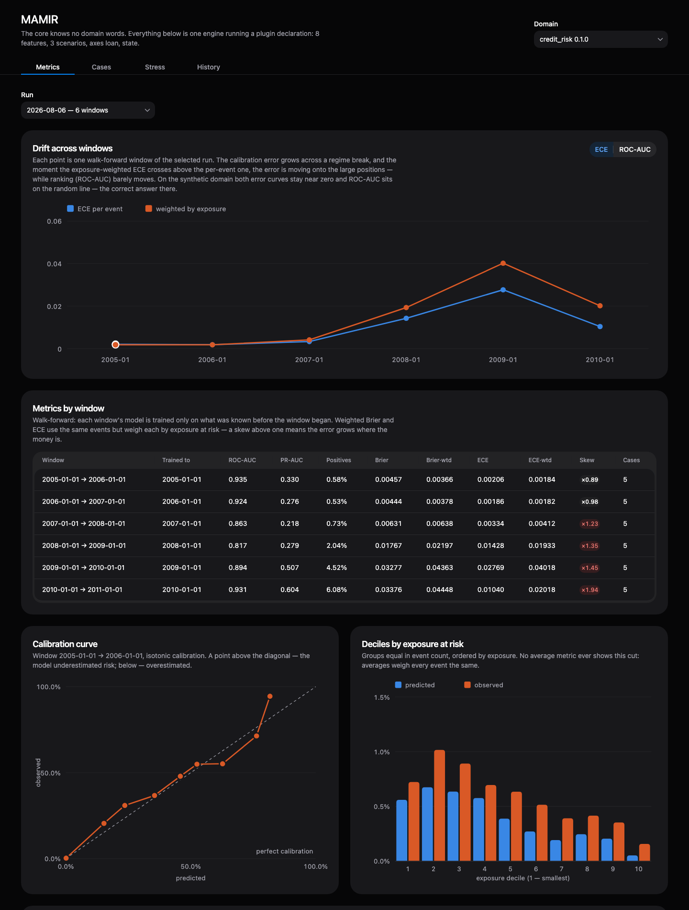
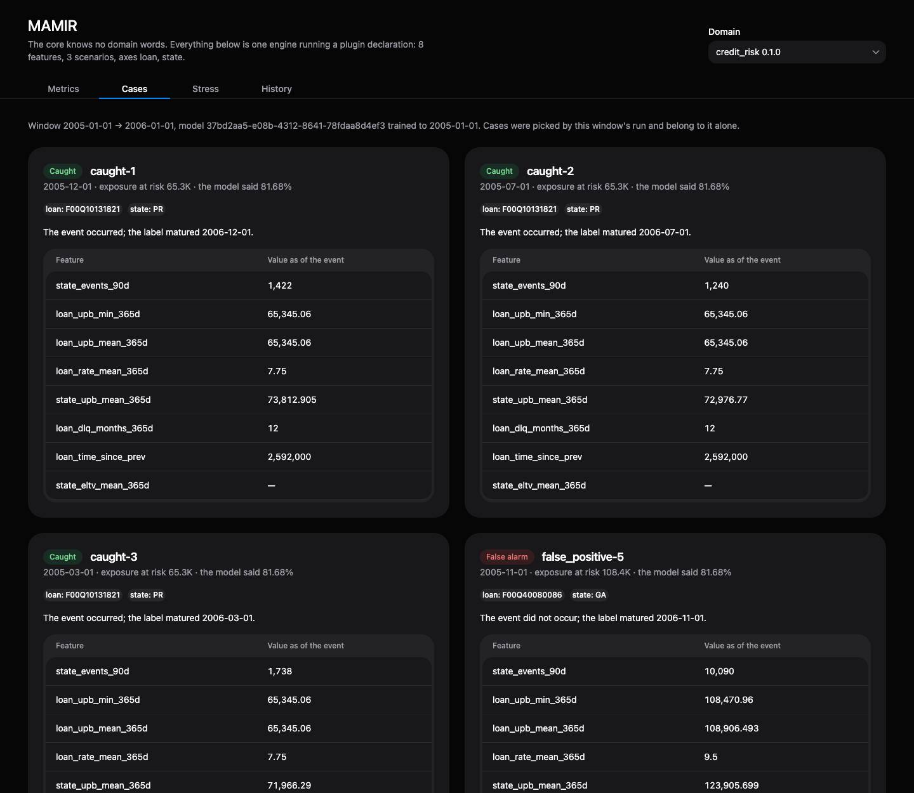

# MAMIR

**Multi-domain Analytics & Modeling for Incident Risk** — a risk analytics engine: it scores events with calibrated probabilities, aggregates them into a portfolio with the money at risk, checks itself against history with a point-in-time backtest and runs scenario stress. Domains plug in.

A model answers one question about one event: is this loan risky. Everything a
risk desk asks next belongs to another layer — how much money is at risk right
now, where it is concentrated, what a shock does to it, and whether what the
model said a year ago matched what actually happened. MAMIR is that layer,
together with the machinery that makes its answers checkable: features computed
point-in-time, a walk-forward backtest, and domains that plug in as data rather
than as code.



## Quick start

```bash
git clone https://github.com/nmrcs/mamir.git && cd mamir && npm install && ./scripts/up.sh
```

That is the engine and its database. The shortest path from here to numbers on a
screen is the synthetic domain: it generates its own data, needs no external
account, and the whole chain takes about fifteen minutes —
[docs/guide.md](docs/guide.md), §3. The mortgage domain needs the Freddie Mac
files and roughly an hour — same guide, §4. Tests run with `npm test` from the
root (Postgres up, nothing else); `./scripts/down.sh` stops the environment.

---

## Documents

This README is the shop window: what the engine is, how it is built, and the
headline numbers. The full chains of commands, the reproduction of every number
and what those numbers mean for a domain live in the documents:

- [docs/guide.md](docs/guide.md) — user guide: concepts in plain terms, filling both domains from scratch, how to read the showcase, pitfalls
- [docs/domains/credit-risk.md](docs/domains/credit-risk.md) — mortgage credit risk: what the domain is, what is in the data, where the traps are
- [docs/domains/payment-fraud.md](docs/domains/payment-fraud.md) — payment fraud: why synthetic, how it works as a null hypothesis, relative time
- [docs/results/credit-risk.md](docs/results/credit-risk.md) — first domain results: metrics, calibration, case walkthrough
- [docs/results/payment-fraud.md](docs/results/payment-fraud.md) — second domain results and the control month

## How it works

```
events → core ─ features (point-in-time) ─→ ML scoring ─→ calibrated probability
                    │                                            │
                    ├─ portfolio exposure + scenario stress       │
                    └─ backtest harness (walk-forward) ───────────┘
```

The core is domain-agnostic: it does not know the words "transaction", "account", "fraud". A plugin is **pure data**, not a single function: event schema, aggregation axis, timestamp, exposure, features, loss definition, scenarios.

**A monorepo, not a monolith:** three independently deployable services in two languages, talking over HTTP. The only infrastructure is Postgres, brought up by Docker Compose; the whole synthetic domain runs end to end on a laptop with nothing else installed.

| Package                                        | Stack                                                           | What it does here                                                                                                                                                                        |
| ---------------------------------------------- | --------------------------------------------------------------- | ---------------------------------------------------------------------------------------------------------------------------------------------------------------------------------------- |
| [packages/contracts](packages/contracts)       | TypeScript, Zod 4                                               | the plugin contract as schemas: a domain is validated whole at startup, cross-references included                                                                                        |
| [apps/backend](apps/backend)                   | NestJS 11, Prisma 7, PostgreSQL 18, `pg-copy-streams`, `undici` | the core: event intake, the window compiler that turns declarations into SQL, exposure, scenarios, the backtest harness. `COPY` loads 26M rows, `undici` keeps the sidecar call at 22 ms |
| [apps/scoring](apps/scoring)                   | Python, FastAPI, scikit-learn, scipy, pandas                    | gradient boosting with isotonic calibration, metrics, and the Monte Carlo loss simulation (`scipy.stats.norm` is the Vasicek model)                                                      |
| [apps/frontend](apps/frontend)                 | React 19, Vite 8, Tailwind 4, HeroUI 3                          | the showcase and, run headless, the generator of the report SVGs — one component set, two carriers                                                                                       |
| [plugins/credit-risk](plugins/credit-risk)     | no runtime code                                                 | domain 1 declared as data: mortgage risk on Freddie Mac SFLLD                                                                                                                            |
| [plugins/payment-fraud](plugins/payment-fraud) | no runtime code                                                 | domain 2 declared as data: payment fraud, IEEE-CIS shape on synthetic data                                                                                                               |

The core/plugin boundary is held not by folder layout but by the dependency graph, a ban on relative imports across package boundaries, and `npm run boundary` — an executable check that looks for a plugin package imported by the core and for a plugin declared as its dependency.

### The showcase

Everything the engine computed is readable without a database client. The four
tabs — metrics by window (above), named cases, scenario stress, checks against
history — read stored runs only: nothing is recomputed on click, because a
portfolio on a balance-sheet domain takes minutes to assemble. The domain
selector at the top right is the whole of what the core knows about a domain;
picking the other one redraws every tab from a different plugin declaration.

A case is not a row of numbers: it opens with the feature vector as of the
event, and the miss is shown in the same detail as the hits.



### Point-in-time

A feature is declared (`{ entity, source, agg, window }`) and computed by the core. There are two execution forms — a pointwise one for real time and a windowed one for the backtest; their equivalence is checked on a sample (3,200 pairs, 0 mismatches; the check itself was validated by breaking it — swapping `<` for `<=` produces 272 mismatches).

Four sources of leakage are handled explicitly: the future inside the window; `occurredAt` versus `ingestedAt` (only what was **known** as of time t is available); immature labels; and labels computed on truncated future — for events in the last horizon the window runs into the edge of history.

## Results

Every number below is quoted with its test window and the cutoff the model was
trained up to, and is reproduced by the commands in the domain reports.

### Backtest: `credit-risk`

Freddie Mac SFLLD: 26,538,649 events across 50,000 loans from each origination
year 1999–2007. Walk-forward, six annual steps, not a single random split: at
every step the model is retrained on all history before the test window, on
labels matured as of the same moment.

| test window |    events | default rate | ROC-AUC | PR-AUC |    Brier | log-loss |     ECE | ECE, wtd. | skew |
| ----------- | --------: | -----------: | ------: | -----: | -------: | -------: | ------: | --------: | ---: |
| 2005        | 1,782,314 |       0.579% |  0.9347 | 0.3298 | 0.004571 |  0.02118 | 0.00206 |   0.00184 | 0.89 |
| 2006        | 2,129,557 |       0.535% |  0.9245 | 0.2763 | 0.004438 |  0.02079 | 0.00186 |   0.00182 | 0.98 |
| 2007        | 2,505,082 |       0.727% |  0.8627 | 0.2182 | 0.006306 |  0.03146 | 0.00334 |   0.00412 | 1.24 |
| 2008        | 2,606,167 |       2.044% |  0.8175 | 0.2788 | 0.017666 |  0.08765 | 0.01428 |   0.01933 | 1.35 |
| 2009        | 2,263,057 |       4.521% |  0.8943 | 0.5072 | 0.032767 |  0.13254 | 0.02769 |   0.04018 | 1.45 |
| 2010        | 1,878,314 |       6.081% |  0.9306 | 0.6038 | 0.033760 |  0.12285 | 0.01040 |   0.02018 | 1.94 |

"ECE, wtd." is the same calibration error with every event weighted by its
exposure; "skew" is its ratio to the plain one. Five independent runs reproduce
these values to the last digit. Baselines computed under the same protocol —
single-column sort, logistic regression, a constant — live in
[reports/baseline-credit-risk.json](reports/baseline-credit-risk.json); the
protocol, the excluded feature and the crisis-window analysis are in
[docs/results/credit-risk.md](docs/results/credit-risk.md).

### Backtest: `payment-fraud` as a null hypothesis

The second domain runs on synthetic data in the shape of IEEE-CIS
([generator](scripts/synthetic-csv.mjs)); its label is independent of every
feature by construction, so the correct answer is known in advance and any lift
over chance means leakage. The engine returns chance: ROC-AUC 0.492–0.504
across three walk-forward windows, PR-AUC at the fraud rate, the calibration
curve collapsed to a point. The portfolio layer passes the same control: the
realized loss of a control month lands inside the simulated distribution —
98.25th percentile, 876 of 50,000 paths worse — where an engine that
manufactures alarms out of random data would land in the tail. The tables and
the episode are in [docs/results/payment-fraud.md](docs/results/payment-fraud.md).



### Real-time scoring

`POST /events` computes features and returns a calibrated probability
synchronously: 32 ms p50 and 43 ms p95 end to end on 26.5M ingested events, of
which the eight pointwise features cost 4 ms. The measurement is reproduced by
`npm run bench -w @mamir/backend -- --plugin credit_risk --count 50`; the curl,
the per-stage table and the fail-open behaviour (`score: null` when scoring is
down, the event is still accepted) are in [docs/guide.md](docs/guide.md), §6.

### The portfolio layer

The `credit_risk` portfolio as of 1 January 2009: 207,867 positions, $29.83bn
exposure, $161.4m expected loss — against $546.4m realized, a gap of ×3.39.
Scenario stress goes through the same window compiler that builds training
vectors: +3 pp on the mortgage rate adds 9.6% of expected loss, tripled amounts
on fraud add 180%, and a shock that finds no data (`regional_shock` on a field
absent in the crisis window) reports `untouched` rather than zero risk. The
loss distribution — Vasicek single factor, 50,000 Monte Carlo paths — is quoted
as a band over the correlation ρ, the least reliable parameter in the system:
at ρ measured on calm years the realized 2009 loss lies beyond the worst
simulated path; with hindsight values of ρ it is the 98.7–99.5th percentile.
The tables, the timings and how the three runs read together are in
[docs/results/credit-risk.md](docs/results/credit-risk.md), §8.

## Data and what is published

**Only the first domain uses real data.** Freddie Mac is downloaded under your own account (Clarity, redistribution prohibited) and is not in the repository; what is published are derivatives — metrics, cases, charts. The second domain is synthetic in the shape of IEEE-CIS: calibration is not measured on it, the absence of leakage is.

Caveats that belong to a domain — what its timestamps really are, which horizons are assumptions, which statistical test is used outside its original purpose — are stated in that domain's own documents, next to the numbers they qualify.

## Author and license

Built solo by Nikita MRCS — [@nmrcs](https://github.com/nmrcs). Every design
decision, every number and every mistake in this repository is mine.

MIT.
